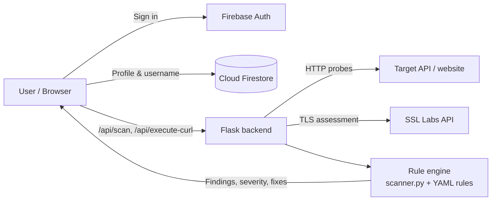

<div align="center">

# 🛡️ API Secure

**Find the security gaps in your APIs and websites before attackers do.**

Scan any endpoint for common misconfigurations, get clear, evidence-backed findings with fixes, and test real requests from a single, fast web app.


**[▶ Watch the demo](./docs/demo.mp4)** · **[Setup guide](./SETUP.md)** · **[Security policy](./SECURITY.md)**

</div>

---

## Table of contents

- [Overview](#overview)
- [Demo](#demo)
- [Features](#features)
- [Security checks](#security-checks)
- [How it works](#how-it-works)
- [Tech stack](#tech-stack)
- [Getting started](#getting-started)
- [Configuration](#configuration)
- [Deployment](#deployment)
- [API reference](#api-reference)
- [Project structure](#project-structure)
- [Testing](#testing)
- [About the analysis engine](#about-the-analysis-engine)
- [Security and responsible use](#security-and-responsible-use)
- [Roadmap](#roadmap)
- [Contributing](#contributing)
- [Credits](#credits)

---

## Overview

Most real-world API breaches don't start with sophisticated exploits. They start with **simple misconfigurations**: a missing security header, a server that announces its exact software version, a CORS policy that trusts any origin, or an error page that leaks a stack trace.

Checking for these usually means juggling several tools and reading raw output. **API Secure** puts it all in one place:

1. **Scan.** Enter a URL and pick the checks to run.
2. **Understand.** Every finding comes with a severity, the evidence, why it matters, and how to fix it.
3. **Test.** Paste any cURL command, edit it in place, send it, and run security tests on the exact request.

---

## Demo

A 2-minute narrated walkthrough covering sign-in, scanning, reports, and Test Curl:

**[▶ Watch `docs/demo.mp4`](./docs/demo.mp4)**

---

## Features

### 🔍 Security Scanner
- Scan any `http://` or `https://` API or website against **7 security checks**.
- **Scan profiles**: *Quick* (essential checks, about 2 min), *Standard* (all checks, about 5 min), or *Custom* (pick your own).
- **Active or passive CORS testing**, with an optional custom `Origin`.
- Live progress while the scan runs against the target.

### 📊 Clear, actionable reports
- Per-check report tabs with an **overall risk grade** and **Critical / High / Medium / Low / Info** severities.
- Every finding includes **evidence**, a plain-language **risk explanation**, and **recommended fixes**, with configuration examples where relevant.
- **Downloadable HTML reports**.
- **Scan history** kept in the browser, with recent scans one click away.

### 🧪 Test Curl
- Paste any cURL command. It's parsed and **syntax-highlighted** instantly.
- **Click any value to edit it in place** (URL, method, header, body). No separate edit mode needed.
- Imported commands are **sent verbatim**, so what you test is exactly what you pasted.
- Inspect the full response: status, timing, headers, and body.
- **Request chaining**: run multiple requests in sequence with token injection.
- Run **security tests directly on a captured request**.

### 🔐 Accounts
- **Sign in with Google** through Firebase Authentication.
- First-time users must **set a strong password** before entering the app. A live checklist and strength meter enforce the rules, and the step can't be skipped.
- Sign in afterwards with **Google, email, or username** and password.
- Profiles and unique usernames are stored in **Cloud Firestore**, locked down with per-user security rules.

### 🎨 Polished experience
- Clean, modern UI with **light and dark themes**.
- Responsive layout for desktop and mobile.
- In-app "About analysis" info panel.

---

## Security checks

| # | Check | What it looks for |
|---|---|---|
| 1 | **HTTP Header Analysis** | Missing or weak security headers: Content-Security-Policy, HSTS, X-Frame-Options, Referrer-Policy, Permissions-Policy, COOP/COEP, X-Content-Type-Options, and deprecated or info-leaking headers |
| 2 | **SSL / TLS Analysis** | Certificate details, protocol versions, weak cipher suites, and an overall grade, using SSL Labs |
| 3 | **Server Version Disclosure** | Headers that reveal server software or versions (e.g. `Server: gunicorn/19.9.0`), with stack inference and severity |
| 4 | **CORS Validation** | Passive or active origin testing, OPTIONS preflight, reflected or wildcard origins, and credential exposure |
| 5 | **Improper Error Handling** | Error responses that leak stack traces, database names, or technology details |
| 6 | **URL Tampering** | Path-traversal and malformed-query probes, reporting status codes and response sizes |
| 7 | **Sensitive Data Exposure** | PII or sensitive data returned in clear text |

HTTP header rules are defined declaratively in [`security-controls/http-header-analysis/`](./security-controls/http-header-analysis/) as YAML and loaded by `header_rules.py`. You can add or tune rules without touching scanner code.

---

## How it works



- The **React frontend** handles authentication, the UI, and scan history.
- The **Flask backend** performs every outbound request, so the browser never talks to the target directly and CORS restrictions don't get in the way of testing.
- Findings come from a **deterministic, rule-based engine**, which keeps results fast, reproducible, and free to run.

---

## Tech stack

| Layer | Technologies |
|---|---|
| **Frontend** | React 18, Vite 7, React Router, Framer Motion, Lucide icons |
| **Backend** | Python 3, Flask 3, Requests, PyYAML, openpyxl, Gunicorn |
| **Auth & data** | Firebase Authentication (Google + Email/Password), Cloud Firestore |
| **External services** | Qualys SSL Labs API (TLS grading) |
| **Hosting** | Render (single web service serving the API and the built frontend) |

---

## Getting started

> **New machine or handing the project to someone else?** Follow **[SETUP.md](./SETUP.md)**. It walks through everything from scratch, including the Firebase console settings, in about 20 minutes.

### Prerequisites
- Python 3.8+
- Node.js 20+
- A Firebase project with **Google** and **Email/Password** sign-in enabled and a **Firestore** database (see [SETUP.md](./SETUP.md))

### Quick start

**1. Backend** (terminal 1)
```bash
cd "Main Project"
python3 -m venv .venv
.venv/bin/pip install -r requirements.txt
cp .env.example .env          # optional: limits, CORS, email
.venv/bin/python app.py       # → http://localhost:3001
```

**2. Frontend** (terminal 2)
```bash
cd "Main Project/frontend"
cp .env.example .env          # add your Firebase web config
npm install
npm run dev                   # → http://localhost:5173
```

Open **http://localhost:5173**, sign in with Google, and run your first scan. The dev server proxies `/api` to the backend on port 3001.

---

## Configuration

### Frontend: `frontend/.env`

| Variable | Description |
|---|---|
| `VITE_FIREBASE_API_KEY` | Firebase web API key |
| `VITE_FIREBASE_AUTH_DOMAIN` | e.g. `your-project.firebaseapp.com` |
| `VITE_FIREBASE_PROJECT_ID` | Firebase project ID |
| `VITE_FIREBASE_STORAGE_BUCKET` | Storage bucket |
| `VITE_FIREBASE_MESSAGING_SENDER_ID` | Sender ID |
| `VITE_FIREBASE_APP_ID` | Web app ID |
| `VITE_FIREBASE_MEASUREMENT_ID` | Analytics measurement ID |

> `VITE_*` values are baked in at build time. Restart `npm run dev`, or rebuild, after changing them.

### Backend: `.env` (all optional)

| Variable | Default | Description |
|---|---|---|
| `FLASK_ENV` | `development` | `development` or `production` |
| `PORT` | `3001` | Backend port |
| `CORS_ORIGINS` | `*` | Comma-separated allowed origins; restrict in production |
| `MAX_URLS_PER_SCAN` | `50` | Maximum URLs per scan request |
| `MAX_UPLOAD_SIZE_MB` | `5` | Maximum CSV/Excel upload size |
| `SCANNER_TIMEOUT` | `15` | Outbound request timeout (seconds) |
| `SSL_LABS_EMAIL` | none | Registered email for SSL Labs API v4 |
| `SMTP_*` / `GOOGLE_*` | none | Optional email delivery of reports (SMTP or Gmail OAuth); see `.env.example` |

Never commit `.env` files. Both are already listed in `.gitignore`.

---

## Deployment

The app deploys to **[Render](https://render.com)** as a single web service. Flask serves both the API and the built React app, so no CORS setup is needed.

| Setting | Value |
|---|---|
| Runtime | Python 3 |
| Build command | `bash build.sh` |
| Start command | `gunicorn app:app --workers 1 --threads 8 --timeout 600 --bind 0.0.0.0:$PORT` |
| Environment | All `VITE_FIREBASE_*` values, plus `FLASK_ENV=production`, `PYTHON_VERSION=3.13.13`, `NODE_VERSION=22` |

`build.sh` installs the Python dependencies, builds the frontend, and copies it into `public/`. The long `--timeout` lets SSL/TLS scans run for several minutes. After the first deploy, add your `*.onrender.com` domain under **Firebase → Authentication → Settings → Authorized domains**.

---

## API reference

| Method | Endpoint | Description |
|---|---|---|
| `GET` | `/api/health` | Health check |
| `POST` | `/api/scan` | Run the selected security checks against one or more URLs |
| `POST` | `/api/download-report` | Generate a downloadable HTML report from scan results |
| `POST` | `/api/parse-urls` | Parse a URL list from pasted text or a CSV/Excel upload |
| `POST` | `/api/execute-curl` | Execute a cURL command and return the full response |
| `POST` | `/api/execute-curl-chain` | Execute a sequence of cURL commands with token injection |

Any other `GET` path serves the frontend, which supports client-side routes such as `/scanner` and `/testcurl`.

---

## Project structure

```
Main Project/
├── app.py                  # Flask app: API routes, static frontend, SPA fallback
├── scanner.py              # Security checks: headers, CORS, SSL/TLS, disclosure, errors, tampering
├── header_rules.py         # Loads the YAML HTTP-header rules
├── template_analysis.py    # Rule-based summaries, risk ratings and recommendations
├── ai_service.py           # Optional LLM integration (not used by the app today)
├── email_service.py        # Optional report email (SMTP / Gmail OAuth)
├── config.py               # Environment-based configuration
├── build.sh                # Production build (used by Render)
├── requirements.txt
├── security-controls/
│   └── http-header-analysis/   # Declarative YAML rule definitions
├── tests/
│   └── test_header_rules_diff.py
├── scripts/
│   └── get_gmail_refresh_token.py
├── docs/
│   └── demo.mp4            # Narrated demo video
└── frontend/               # React + Vite
    ├── src/
    │   ├── App.jsx         # Scanner, reports, Test Curl, history, settings
    │   ├── components/     # LoginPage, ProfileSetup, Sidebar, WelcomeScreen, …
    │   ├── lib/            # firebase.js, auth.js
    │   ├── utils/          # userProfile.js (Firestore profiles)
    │   └── index.css       # Design system (light/dark themes)
    ├── vite.config.js      # Dev proxy: /api → localhost:3001
    └── package.json
```

---

## Testing

A behavioural test suite checks that every HTTP-header rule produces exactly the expected finding. If anyone edits a YAML rule and changes its behaviour by accident, the suite catches it:

```bash
cd "Main Project"
.venv/bin/python tests/test_header_rules_diff.py
```

---

## About the analysis engine

Reports are produced by **lightweight, rule-based scripting and basic analysis**. No external or locally hosted LLM is used.

- A local LLM such as **BART** could be integrated for AI-based analysis in the future. However, the backend is currently deployed on **Render's free tier**, which has resource limitations and cannot host an LLM model of 3 GB or larger.
- Using external LLM APIs would also introduce additional usage costs.
- The current implementation has therefore been **intentionally built on rule-based analysis**.

The architecture can be extended to support **AI-powered analysis, intelligent vulnerability interpretation, automated recommendations, and deeper security insights** once suitable infrastructure or an appropriate LLM service is available. `ai_service.py` and the `OPENROUTER_*` settings are kept for that purpose, but the app doesn't call them.

---

## Security and responsible use

- **Only scan systems you own or have explicit permission to test.** Unauthorised scanning may be illegal in your jurisdiction.
- Only `http://` and `https://` targets are accepted. Uploads are validated by type and size, and scans are capped per request.
- Every backend response carries hardening headers (`nosniff`, `X-Frame-Options: DENY`, strict referrer policy).
- No secrets are hard-coded. All configuration comes from environment variables.
- Found a vulnerability in API Secure itself? Please follow the disclosure process in **[SECURITY.md](./SECURITY.md)**.

---

## Roadmap

- [ ] AI-assisted vulnerability interpretation (when hosting allows)
- [ ] Scheduled and recurring scans with email alerts
- [ ] Shareable report links
- [ ] Additional checks (rate limiting, authentication weaknesses, OpenAPI-driven testing)
- [ ] Team workspaces and cloud-synced scan history

---

## Contributing

Contributions are welcome.

1. Fork the repository and create a feature branch.
2. Keep changes focused. Run the test suite before opening a pull request.
3. Describe **what** changed and **why** in the PR.

For HTTP-header rules, prefer editing the YAML in `security-controls/` over changing `scanner.py`.

---

## Credits

Engineered by **Faizan Q & Team**.

<div align="center">

⭐ If API Secure helped you, consider starring the repository.

</div>
